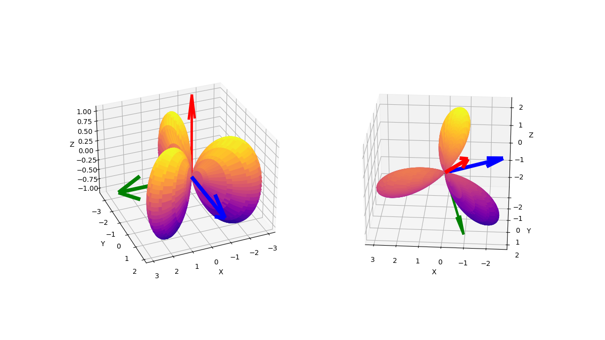

# Rotate Homogeneous Polynomials

On my [blog](https://rao.im/mathematics/2019/10/25/compute-so3-repns/) I presented an algorithm for rotating homogeneous polynomials ( in variables $x$, $y$, and $z$ ) by computing representations of $SO(3)$ on $$\mathcal{P}_d$$, homogeneous polynomials of degree $d$. These representations are matrices in $SO(\mathcal{P}_d)$ and are rotations of  $$p \in \mathcal{P}_d$$. 

The algorithm described in a my [blog](https://rao.im/mathematics/2019/10/25/compute-so3-repns/) post is implemented in `generate_so3_representation.py`. The entry point is function `representationOfSO3`, and it generates a representation of any given $A \in SO(3)$ on  $\mathcal{P}_d$.  

Scripts `harmonic-dim-2-comparison.py` and `harmonic-dim-3-comparison.py` demonstrate the effect of rotation by representations of randomly generated $SO(3)$ matrices on two specific harmonic homogeneous polynomials of dimension $2$ and $3$, respectively. 

## Rotate $xy$

A trivial example is harmonic polynomial $xy$. Using script `harmonic-dim-2-comparison.py` a representation on $\mathcal{P}_2$ of randomly generated $SO(3)$ matrix 
```math
A=
\begin{bmatrix}
0.357129979786826 && 0.866523063310198 && 0.348706120234463 \\
-0.619992791031964 && 0.499137036044723 && -0.605368613587527 \\
-0.698618004782196 && 0 && 0.715494852108765 \\
\end{bmatrix},
```

with axis of rotation located at $\theta = 0.7734641469345384$ radians and $\phi = 5.234991577347525$ radians, was generated and applied to harmonic homogeneous polynomial $xy$. In figure below, the unrotated polynomial $xy$ (on right) and its rotation by the generated representation (on left) are plotted.

The figure on the left is $xy$ in the standard x-y-z frame, and the figure on the right is its rotation by $\rho(A)$. The colored arrows are original and rotated frames, respectively.

<figure>
<div align="center">
	
</div>
  <figcaption align="left"> 
    On the left is a graph of spherical harmonic function $xy$ in the standard x-y-z frame. On the right is its rotation. The colored arrows are the original and rotated frames, respectively. The z-axis is the <span style="color: red">red</span> arrow, the y-axis is the <span style="color: blue">blue</span> arrow, and x-axis is the <span style="color: green">green</span> arrow. Like colored arrows map to like colored arrows. For example the <span style="color: red">red</span> arrow in left graph maps to the <span style="color: red">red</span> arrow in right graph.
  </figcaption> 
</figure>


## Rotate $x^2y - \frac{1}{3}y^3$

A less trivial example is harmonic polynomial $x^2y - \frac{1}{3}y^3$. Using script `harmonic-dim-3-comparison.py` a representation on $\mathcal{P}_3$ of randomly generated $SO(3)$ matrix 
```math
A = 
\begin{bmatrix*}
-0.320757648736410 & -0.868123551589577 & -0.378782298890258 \\
0.561011986806716 & -0.496348163263952 & 0.662498340740323 \\
-0.763138310816768 & 0 & 0.646235188274153 \\
\end{bmatrix*},
```


with rotation axis located at $\theta = 0.8681555864627436$ radians and $\phi = 2.0901834326555337$ radians, was generated and applied to $x^2y - \frac{1}{3}y^3$. In figure below, the unrotated polynomial $x^2y - \frac{1}{3}y^3$ (on right) and its rotation by the generated representation (on left) are plotted as   

<figure>
<div align="center">
	
</div>
  <figcaption align="left"> 
    On the left is a graph of spherical harmonic function $xy$ in the standard x-y-z frame. On the right is its rotation. The colored arrows are the original and rotated frames, respectively. The z-axis is the <span style="color: red">red</span> arrow, the y-axis is the <span style="color: blue">blue</span> arrow, and x-axis is the <span style="color: green">green</span> arrow. Like colored arrows map to like colored arrows. For example the <span style="color: red">red</span> arrow in left graph maps to the <span style="color: red">red</span> arrow in right graph.
  </figcaption> 
</figure>
