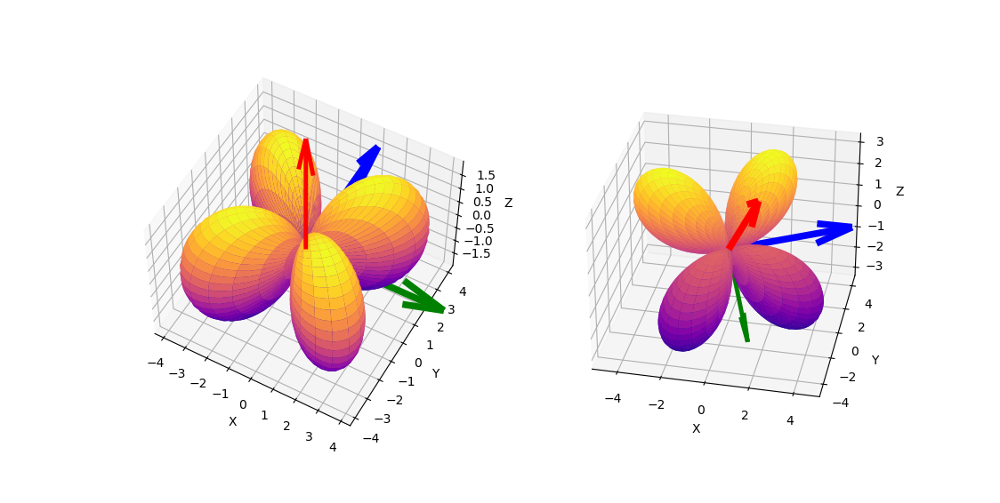

# Rotate Spherical Harmonics

Several years ago I presented on my [blog](https://rao.im/mathematics/2019/10/25/compute-so3-repns/) an algorithm for rotating homogeneous polynomials ( in variables $x$, $y$, and $z$ ) by computing representations of $SO(3)$ on $$\mathcal{P}_d$$, homogeneous polynomials of degree $d$. These representations are matrices in $SO(\mathcal{P}_d)$ and are rotations of  $$p \in \mathcal{P}_d$$. I wrote an implementation in Python, but I did not, until now, demonstrate how to use my algorithm to rotate a homogeneous polynomial.

The scripts published here generate figures like the one below, showing a randomly generated rotation representation in $SO(\mathcal{P}_2)$ applied to homogeneous polynomial $xy$. The figure on the left is $xy$ in the standard x-y-z frame, and the figure on the right is its rotation. The colored arrows are original and rotated frames, respectively.

